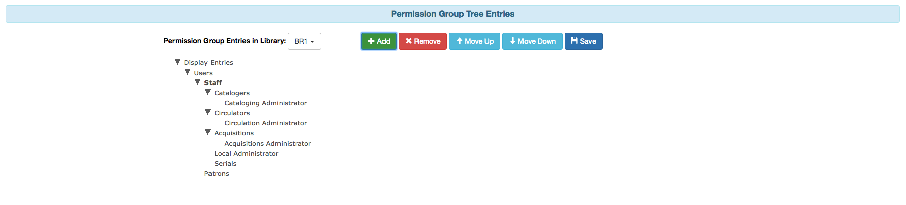
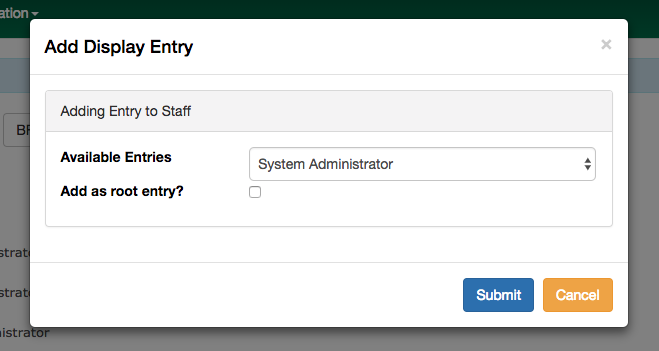

Evergreen 3.2 Release Notes
===========================
:toc:
:numbered:

Evergreen 3.2.10
----------------

This release contains bug fixes improving on Evergreen 3.2.9.

Bug Fixes
~~~~~~~~~

* Fix MARC View Display Issues (https://bugs.launchpad.net/evergreen/+bug/1843637[Bug 1843637])
* Add missing columns to patron record (https://bugs.launchpad.net/evergreen/+bug/1739607[Bug 1739607])
* Mark the permission.grp_descendants database table as STABLE (https://bugs.launchpad.net/evergreen/+bug/1768141[Bug 1768141])
* Webstaff locale picker repairs (https://bugs.launchpad.net/evergreen/+bug/1560805[Bug 1560805])
* Assign copy alert permissions (https://bugs.launchpad.net/evergreen/+bug/1811442[Bug 1811442])
* Fix issue where reports interface was partially loaded (https://bugs.launchpad.net/evergreen/+bug/1845050[Bug 1845050])
* Handle autorenewals when aging circulations (https://bugs.launchpad.net/evergreen/+bug/1840669[Bug 1840669])
* Default circulation auto_renewal field to FALSE (https://bugs.launchpad.net/evergreen/+bug/1839002[Bug 1839002])
* Add missing Auto Renewal fields to the IDL (https://bugs.launchpad.net/evergreen/+bug/1835577[Bug 1835577])
* Refactor auto_renewal back end code (https://bugs.launchpad.net/evergreen/+bug/1835035[Bug 1835035])
* Update Item Status templates for auto-renewal (https://bugs.launchpad.net/evergreen/+bug/1835085[Bug 1835085])
* Improve permissions when editing user accounts (e.g. editing your own account) (https://bugs.launchpad.net/evergreen/+bug/1842940[Bug 1842940])
* Reduce the cost of utility functions, speeding up search (https://bugs.launchpad.net/evergreen/+bug/1836963[Bug 1836963])
* Fixes Current Date in Date Returned in Circ History CSV (https://bugs.launchpad.net/evergreen/+bug/1813056[Bug 1813056])
* Fix Last Captured Hold Check for Holds Shelf (https://bugs.launchpad.net/evergreen/+bug/1827250[Bug 1827250])
* Only include OPAC-visible copies in SRU/Z39.50 holdings (https://bugs.launchpad.net/evergreen/+bug/1609556[Bug 1609556])
* Re-alphabetize Local & Server Administration Links (https://bugs.launchpad.net/evergreen/+bug/1803790[Bug 1803790])
* Allow saving Bill Full Details grids (https://bugs.launchpad.net/evergreen/+bug/1729435[Bug 1729435])
* Improve usability of Patron Bill History date selector (https://bugs.launchpad.net/evergreen/+bug/1841089[Bug 1841089])
* Fix when the "duplicate barcode" alert appears (https://bugs.launchpad.net/evergreen/+bug/1777698[Bug 1777698])
* Fix paging of pending patrons (https://bugs.launchpad.net/evergreen/+bug/1749970[Bug 1749970])
* Check bib visibility for located URI auto suggest (https://bugs.launchpad.net/evergreen/+bug/1802952[Bug 1802952])
* Patron Prefix and Suffix Display in Summary (https://bugs.launchpad.net/evergreen/+bug/1821969[Bug 1821969])
* Do not include Tag Owner in Tag (https://bugs.launchpad.net/evergreen/+bug/1825403[Bug 1825403])
* Avoid hard-coded paths in Apache config (https://bugs.launchpad.net/evergreen/+bug/1844720[Bug 1844720])
* Require some Storage submodules instead of use them (https://bugs.launchpad.net/evergreen/+bug/1835620[Bug 1835620])
* Remove extra grid refresh from configuration load (https://bugs.launchpad.net/evergreen/+bug/1846038[Bug 1846038])

Acknowledgements
~~~~~~~~~~~~~~~~
We would like to thank the following individuals who contributed code,
testing and documentation patches to the 3.2.10 point release of Evergreen:

* Bill Erickson
* Chris Sharp
* Dan Briem
* Dan Wells
* Galen Charlton
* Garry Collum
* Jane Sandberg
* Jason Boyer
* Jason Stephenson
* Jeff Davis
* Jeff Godin
* Jennifer Pringle
* John Amundson
* Josh Stompro
* Kyle Huckins
* Michele Morgan
* Mike Rylander
* Remington Steed
* Terran McCanna

Evergreen 3.2.9
----------------
This release is a security release that fixes cross-site scripting
(XSS) vulnerabilities in the Evergreen public catalog. This release
also includes several other bugfixes improving on Evergreen 3.2.8.

Security Issue: XSS Vulnerability in Public Catalog
~~~~~~~~~~~~~~~~~~~~~~~~~~~~~~~~~~~~~~~~~~~~~~~~~~~
This release fixes several cross-site scripting (XSS) vulnerabilities
in the public catalog. When upgrading, Evergreen administrators should
review whether any of the following templates have been customized
or overridden. If so, either the template should be replaced with the
stock version or the XSS fix (which entails adding the `| html` filter
in several places) applied to the customized version.

 * `Open-ILS/src/templates/opac/browse.tt2`
 * `Open-ILS/src/templates/opac/parts/ebook_api/base_js.tt2`
 * `Open-ILS/src/templates/opac/parts/header.tt2`
 * `Open-ILS/src/templates/opac/parts/place_hold.tt2`
 * `Open-ILS/src/templates/opac/parts/place_hold_result.tt2`
 * `Open-ILS/src/templates/opac/parts/result/adv_filter.tt2`

They should also review the following templates.  If these templates have
been customized or overridden, either the template should be replaced with
the stock version or the XSS fix (which entails adding `rel="nofollow` to
external links) applied to the customized version.

* `Open-ILS/src/templates/opac/parts/record/summary.tt2`
* `Open-ILS/src/templates/opac/parts/result/table.tt2`

Other Bugfixes
~~~~~~~~~~~~~~
Evergreen 3.2.9 also includes the following changes:

General
^^^^^^^

* Users can now save sort priorities for grids throughout the client
(https://bugs.launchpad.net/evergreen/+bug/1790169[Bug 1790169])

Circulation
^^^^^^^^^^^

* Default hold transit slips no longer include patron's personal
information (https://bugs.launchpad.net/evergreen/+bug/1735847[Bug 1735847])
* Fixes an issue with the reshelving process
(https://bugs.launchpad.net/evergreen/+bug/1018011[Bug 1018011])

Reports
^^^^^^^

* Fixes issues related to cloning templates made in the XUL client
(https://bugs.launchpad.net/evergreen/+bug/1796945[Bug 1796945])

Acknowledgements
~~~~~~~~~~~~~~~~
We would like to thank the following individuals who contributed code,
tests and documentation patches to the 3.2.9 security release of
Evergreen:

* Thomas Berezansky
* Jason Boyer
* Galen Charlton
* Jeff Davis
* April Durrence
* Jason Etheridge
* Blake Graham-Henderson
* Andrea Buntz Neiman
* Debbie Luchenbill
* Dan Pearl
* Jane Sandberg
* Dan Scott
* Chris Sharp
* Remington Steed
* Jason Stephenson
* Dan Wells
* Derek C. Zoladz

Evergreen 3.2.8
---------------

This release contains bug fixes improving on Evergreen 3.2.7.
All bug fixes refer to the web staff client unless otherwise specified.

Bug fixes
~~~~~~~~~

General
^^^^^^^

* Accessibility improvements to the date picker calendar button (https://bugs.launchpad.net/evergreen/+bug/1796903[Bug #1796903])
* Blank values in CSV grid downloads now show as blank instead of reading 'null' (https://bugs.launchpad.net/evergreen/+bug/1766982[Bug #1766982])
* Fixes invalid language codes in the staff client and KPAC (https://bugs.launchpad.net/evergreen/+bug/1802593[Bug #1802593])
* Fixes display issue with menus at certain screen resolutions (https://bugs.launchpad.net/evergreen/+bug/1813078[Bug 1813078])
* Removes duplicate columns from several grids (https://bugs.launchpad.net/evergreen/+bug/1683385[Bug 1683385])
* Adds a login failed message to the Angular sign in screen when appropriate (https://bugs.launchpad.net/evergreen/+bug/1834969[Bug 1834969])

Acquisitions
^^^^^^^^^^^^

* Adds fund year to Distribution Formula fund dropdown menu (https://bugs.launchpad.net/evergreen/+bug/1329920[Bug 1329920])

Cataloging
^^^^^^^^^^

* Extra whitespace in 856$9 subfields no longer prevents located URIs from being displayed in electronic resource records. (https://bugs.launchpad.net/evergreen/+bug/1722827[Bug #1722827])
* Fixes issue in Item Status import where spaces or empty lines in barcode files caused an import failure (https://bugs.launchpad.net/evergreen/+bug/1798187[Bug #1798187])
* The Item Status list and detail views now have the same actions available. (https://bugs.launchpad.net/evergreen/+bug/1775920[Bug #1775920])
* Adds record summary display to merge records (https://bugs.launchpad.net/evergreen/+bug/1739292[Bug #1739292])
* Fixes issue in Bucket grids where grid configurations were not saving correctly (https://bugs.launchpad.net/evergreen/+bug/1805895[Bug# 1805895])
* "Local catalog" is now at the top of the list of Z39.50 sources. (https://bugs.launchpad.net/evergreen/+bug/1787676[Bug #1787676])
* Fixes issue with authority_control_field.pl script (https://bugs.launchpad.net/evergreen/+bug/1650409[Bug #1650409])
* Fixes an issue with the "Retrieve Last Bib Record" action. (https://bugs.launchpad.net/evergreen/+bug/1830424[Bug #1830424])
* Fixes an issue with the Edit buttons in the Merge Records interface. (https://bugs.launchpad.net/evergreen/+bug/1836229[Bug #1836229])
* Fixes an issue with the _Clear_ button in the holdings template editor. (https://bugs.launchpad.net/evergreen/+bug/1803584[Bug #1803584])

Circulation
^^^^^^^^^^^

* Fixes slowness issues with checkin and checkout grids (https://bugs.launchpad.net/evergreen/+bug/1777207[Bug #1777207])
* Fixes an issue that allowed staff to renew items to dates in the past. (https://bugs.launchpad.net/evergreen/+bug/1034058[Bug #1034058])
* Fixes an error that occured when checking in lost items when a certain setting was enabled. (https://bugs.launchpad.net/evergreen/+bug/1511765[Bug #1511765])
* Fixes an issue that caused the money summary to be missing from the patron record Bills tab. (https://bugs.launchpad.net/evergreen/+bug/1800484[Bug #1800484])
* Multiple improvements to the Mark Damaged Popup. (Bugs https://bugs.launchpad.net/evergreen/+bug/1759864[#1759864] and https://bugs.launchpad.net/evergreen/+bug/1742523[#1742523])

Development
^^^^^^^^^^^

* Updates to the Angular client's .editorconfig file. (https://bugs.launchpad.net/evergreen/+bug/1838136[Bug #1838136])

Public catalog
^^^^^^^^^^^^^^

* Accessibility improvements to form fields. (https://bugs.launchpad.net/evergreen/+bug/1735768[Bug #1735768])

Reports
^^^^^^^

* Users can now hard code a list of filter values in a report template (https://bugs.launchpad.net/evergreen/+bug/1785061[Bug #1785061])
* Fixes an issue that caused column labels to re-sort when deleting fields in a template. (https://bugs.launchpad.net/evergreen/+bug/1751800[Bug #1751800])
* Fixes column type for Billing Totals and Billing Paid columns (https://bugs.launchpad.net/evergreen/+bug/1681930[Bug #1681930])

Acknowledgments
~~~~~~~~~~~~~~~
We would like to thank the following individuals who contributed code,
testing and documentation patches to the 3.2.8 point release of
Evergreen:

* Kristy Bauman
* Jason Boyer
* Dan Briem
* Andrea Buntz Neiman
* Galen Charlton
* Garry Collum
* Dawn Dale
* Jeff Davis
* Bill Erickson
* James Fournie
* Rogan Hamby
* Kyle Huckins
* Cheyenne Jones
* Tiffany Little
* Jeanette Lundgren
* Geoff Sams
* Jane Sandberg
* Chris Sharp
* Remington Steed
* Jason Stephenson
* Josh Stompro
* Meg Stroup
* Dan Wells
* Beth Willis

Evergreen 3.2.7
----------------

This release contains bug fixes improving on Evergreen 3.2.6.
All bug fixes refer to the web staff client unless otherwise specified.

Bug fixes
~~~~~~~~~

Circulation
^^^^^^^^^^^
* Corrects a rounding error that caused fines to exceed the max fines
amount
(https://bugs.launchpad.net/evergreen/+bug/1704819[Bug #1704819])
* Corrects an issue with printing Items Out receipts
(https://bugs.launchpad.net/evergreen/+bug/1790896[Bug #1790896])
* SIP Visa payments are now recorded as credit card, rather than cash
payments
(https://bugs.launchpad.net/evergreen/+bug/1796942[Bug #1796942])
* Converting change to patron credit no longer requires staff members
to refresh the screen to see the new credit
(https://bugs.launchpad.net/evergreen/+bug/1775639[Bug #1775639])
* The patron summary now includes tooltips that were available in
the XUL client
(https://bugs.launchpad.net/evergreen/+bug/1772206[Bug #1772206])
* The patron holds grid now includes a SMS Carrier column
(https://bugs.launchpad.net/evergreen/+bug/1748265[Bug #1748265])
* When registering a new patron from Pending Patrons, the address
type dropdown now supports a default value
(https://bugs.launchpad.net/evergreen/+bug/1816180[Bug #1816180])
* The Items Out grid now includes a Monograph Parts column
(https://bugs.launchpad.net/evergreen/+bug/1789257[Bug #1789257])
* The annotate checkbox on the bill payment screen is now sticky
(https://bugs.launchpad.net/evergreen/+bug/1759343[Bug #1759343])
* Group member details grid settings can now be saved
(https://bugs.launchpad.net/evergreen/+bug/1774707[Bug #1774707])
* The patron registration date of birth field can now display a
format example
(https://bugs.launchpad.net/evergreen/+bug/1819181[Bug #1819181])

Cataloging
^^^^^^^^^^

* The MARC editor displays a warning when a cataloger attempts to
close the tab without saving
(https://bugs.launchpad.net/evergreen/+bug/1538678[Bug #1538678])
* The MARC editor displays a warning when permissions issues
prevent a record from saving
(https://bugs.launchpad.net/evergreen/+bug/1693580[Bug #1693580])
* The holdings editor saves default values more consistently
(https://bugs.launchpad.net/evergreen/+bug/1812900[Bug #1812900])
* The flat-text editor now uses a monospace font
(https://bugs.launchpad.net/evergreen/+bug/1817601[Bug #1817601])
* Statistical categories and their entries are now alphabetized in the
holdings editor (Bugs
https://bugs.launchpad.net/evergreen/+bug/1744386[Bug #1744386] and
https://bugs.launchpad.net/evergreen/+bug/1777184[Bug #1777184])
* The holdings editor now lists monograph parts in reverse alphabetical
order
(https://bugs.launchpad.net/evergreen/+bug/1760893[Bug #1760893])
* Buckets created from the MARC Batch Import process are now available
in the MARC Batch Edit interface
(https://bugs.launchpad.net/evergreen/+bug/1440890[Bug #1440890])
* The record bucket interface only displays the Merge action when
multiple records are selected
(https://bugs.launchpad.net/evergreen/+bug/1760599[Bug #1760599])
* Fixes an issue with the displayed number of items out
(https://bugs.launchpad.net/evergreen/+bug/1770217[Bug #1770217])

Client
^^^^^^

* Fixes conflicting dependency information caused be the release of
Angular 8
(https://bugs.launchpad.net/evergreen/+bug/1830972[Bug #1830972])
* Angular grids include several new accessibility features and
keyboard shortcuts
(https://bugs.launchpad.net/evergreen/+bug/1816480[Bug #1816480])
* The menu in the top right corner is now named "Logout and more..."
(https://bugs.launchpad.net/evergreen/+bug/1796914[Bug #1796914])
* Several dropdown menus now require less scrolling
(https://bugs.launchpad.net/evergreen/+bug/1669120[Bug #1669120])

Public Catalog
^^^^^^^^^^^^^^

* Avoids Internal Server Errors on search result page
(https://bugs.launchpad.net/evergreen/+bug/1155706[Bug #1155706])
* Double clicking the Place Hold button can no longer result in
multiple holds
(https://bugs.launchpad.net/evergreen/+bug/1029601[Bug #1029601])

Reports
^^^^^^^

* Adds a more user-friendly interface for boolean filters
(https://bugs.launchpad.net/evergreen/+bug/1642337[Bug #1642337])

System administration
^^^^^^^^^^^^^^^^^^^^^

* Improves consistency in terminology in the Local Administration
screen
(https://bugs.launchpad.net/evergreen/+bug/1776913[Bug #1776913])
* The Library Settings Editor now displays some example timezones
for the lib.timezone setting
(https://bugs.launchpad.net/evergreen/+bug/1817332[Bug #1817332])

Automated tests
^^^^^^^^^^^^^^^
* Fixes an automated test related to translations and internationalization
(https://bugs.launchpad.net/evergreen/+bug/1768987[Bug #1768987])

Database
^^^^^^^^

* Adds some foreign key functions that may be missing from your database
(https://bugs.launchpad.net/evergreen/+bug/1772028[Bug #1772028])

Acknowledgments
~~~~~~~~~~~~~~~
We would like to thank the following individuals who contributed code,
testing and documentation patches to the 3.2.7 point release of
Evergreen:

* John Amundson
* a. bellenir
* Jason Boyer
* Galen Charlton
* Garry Collum
* Dawn Dale
* Jeff Davis
* Bill Erickson
* Jason Etheridge
* Lynn Floyd
* Jeff Godin
* Rogan Hamby
* Kyle Huckins
* Sam Link
* Terran McCanna
* Michele Morgan
* Bill Ott
* Suzanne Paterno
* Dan Pearl
* Mike Risher
* Geoff Sams
* Janet Schrader
* Remington Steed
* Jason Stephenson
* Josh Stompro
* Cesar Velez
* Dan Wells

Evergreen 3.2.6
---------------

This release contains bug fixes improving on Evergreen 3.2.5.
All bug fixes refer to the web staff client unless otherwise specified.

Bug fixes
~~~~~~~~~

General
^^^^^^^

* Fixes a compatibility problem with the Item Status screen related to
  JavaScript arrow functions
  (https://bugs.launchpad.net/evergreen/+bug/1821196[Bug #1821196])

Booking
^^^^^^^

* Fixes a bug in the Booking URL path that failed with newer Apache
  (https://bugs.launchpad.net/evergreen/+bug/1823387[Bug #1823387])

Circulation
^^^^^^^^^^^

* Fixes a display bug with the patron record Group Members list
  (https://bugs.launchpad.net/evergreen/+bug/1642036[Bug #1642036])
* Fixes title sort on the patron Items Out Screen
  (https://bugs.launchpad.net/evergreen/+bug/1782014[Bug #1782014])
* Fixes a refresh bug on the catalog record Holds View tab when moving between
  records (https://bugs.launchpad.net/evergreen/+bug/1792188[Bug #1792188])
* Fixes the ability to place holds from item buckets
  (https://bugs.launchpad.net/evergreen/+bug/1806394[Bug #1806394])

Cataloging
^^^^^^^^^^

* Fixes a bug where copy templates would not apply properly
  (https://bugs.launchpad.net/evergreen/+bug/1788680[Bug #1788680])
* Fixes the default cursor focus on the holdings editor
  (https://bugs.launchpad.net/evergreen/+bug/1752968[Bug #1752968])
* Fixes a bug that failed to honor the "Retain empty bib records"
  (cat.bib.keep_on_empty) setting when transferring items
  (https://bugs.launchpad.net/evergreen/+bug/1333893[Bug #1333893])
* Fixes a bug that failed to include deleted bib records in TCN search
  (https://bugs.launchpad.net/evergreen/+bug/1813633[Bug #1813633])

System administration
^^^^^^^^^^^^^^^^^^^^^

* Added database indexes to speed up purging of Action Trigger event output
  fields (https://bugs.launchpad.net/evergreen/+bug/1778940[Bug #1778940])
* Fixes the help text in action_trigger_aggregator.pl related to the remote-acct
  argument (https://bugs.launchpad.net/evergreen/+bug/1803729[Bug #1803729])
* Adds a missing page title for the Closed Dates Editor
  (https://bugs.launchpad.net/evergreen/+bug/1814943[Bug #1814943])
* Adds a missing page title for the Statistical Popularity Badges admin page
  (https://bugs.launchpad.net/evergreen/+bug/1826890[Bug #1826890])

Acknowledgments
~~~~~~~~~~~~~~~
We would like to thank the following individuals who contributed code,
testing and documentation patches to the 3.2.6 point release of
Evergreen:

* John Amundson
* Jason Boyer
* Galen Charlton
* Garry Collum
* Jeff Davis
* Bill Erickson
* Blake Graham-Henderson
* Rogan Hamby
* Millissa Macomber
* Terran McCanna
* Mike Rylander
* Jane Sandberg
* Janet Schrader
* Remington Steed
* Jason Stephenson
* Josh Stompro
* Dan Wells
* Beth Willis
* John Yorio

Evergreen 3.2.5
---------------

This release contains bug fixes improving on Evergreen 3.2.4.
All bug fixes refer to the web staff client unless otherwise specified.

Bug fixes
~~~~~~~~~

General
^^^^^^^

* Improves the web client splash screen by linking the images along with their links
  (https://bugs.launchpad.net/evergreen/+bug/1802662[Bug #1802662])

Circulation
^^^^^^^^^^^

* Allows the Title Hold screen to remember previously selected pickup library
  (https://bugs.launchpad.net/evergreen/+bug/1665534[Bug #1665534])
* Sorting improvements for printing the Holds Pull List
  (https://bugs.launchpad.net/evergreen/+bug/1749502[Bug #1749502])
* Better display for non-catalogued checkouts in the offline checkout preview
  pane (https://bugs.launchpad.net/evergreen/+bug/1818576[Bug #1818576])

Cataloging
^^^^^^^^^^

* Fixes a bug that changed subfield order in bib record after editing a linked
  authority (https://bugs.launchpad.net/evergreen/+bug/712490[Bug #712490])
* Allows opening multiple selected items in Item Status screen from the Holdings
  View (https://bugs.launchpad.net/evergreen/+bug/1734775[Bug #1734775])
* Adds missing "Deleted?" column choice to Record Buckets
  (https://bugs.launchpad.net/evergreen/+bug/1746360[Bug #1746360])
* Fixes the batch Call Number label field on the Call Number editor to populate
  from the MARC record (https://bugs.launchpad.net/evergreen/+bug/1793196[Bug
  #1793196])
* Fixes a bug to allow editing the call number label for some but not all
  attached items (https://bugs.launchpad.net/evergreen/+bug/1794588[Bug
  #1794588])
* Fixes the sort order of Parts on the Holdings View
  (https://bugs.launchpad.net/evergreen/+bug/1800178[Bug #1800178])
* Adds missing action "Find Originating Acquisition" to Cataloging actions menu
  (https://bugs.launchpad.net/evergreen/+bug/1705497[Bug #1705497])
* Keeps the Item Status screen updated after editing items
  (https://bugs.launchpad.net/evergreen/+bug/1721109[Bug #1721109])
* Fixes a bug with the "checked" state of the Item note "Public Note" checkbox
  (https://bugs.launchpad.net/evergreen/+bug/1778571[Bug #1778571])
* Fixes a bug with Item Alert counts in the Holdings view
  (https://bugs.launchpad.net/evergreen/+bug/1798628[Bug #1798628])
* Improved display when merging bib records from a bucket (side by side, with
  optional holdings) (https://bugs.launchpad.net/evergreen/+bug/1739293[Bug
  #1739293])
* Fixes issues where edits to MARC records would fail to save during merge
  (https://bugs.launchpad.net/evergreen/+bug/1776736[Bug #1776736])

System administration
^^^^^^^^^^^^^^^^^^^^^

* Web client (websocket) logins are now properly tracked as user activity
  (https://bugs.launchpad.net/evergreen/+bug/1818153[Bug #1818153])
* Fixes some log warnings related to Holds Depth
  (https://bugs.launchpad.net/evergreen/+bug/1667497[Bug #1667497])
* Fixes a bug in the fine generator related to Bookings
  (https://bugs.launchpad.net/evergreen/+bug/1819796[Bug #1819796])
* Fixes the Group Penalty Threshold link under the Local Administration menu
  (https://bugs.launchpad.net/evergreen/+bug/1812389[Bug #1812389])
* Fixes a typo in seed data and all related PO files for translation
  (https://bugs.launchpad.net/evergreen/+bug/1759238[Bug #1759238])
* Fixes an error in the sitemap_generator script when using the shortname
  parameter (https://bugs.launchpad.net/evergreen/+bug/1808006[Bug #1808006])

Acknowledgments
~~~~~~~~~~~~~~~
We would like to thank the following individuals who contributed code,
testing and documentation patches to the 3.2.5 point release of
Evergreen:

* John Amundson
* Jason Boyer
* Adam Bowling
* Steven Callender
* Galen Charlton
* Garry Collum
* Bill Erickson
* Jason Etheridge
* Rogan Hamby
* Elaine Hardy
* Kyle Huckins
* Sam Link
* Tiffany Little
* Terran McCanna
* Michele Morgan
* Geoff Sams
* Jane Sandberg
* Janet Schrader
* Chris Sharp
* Ben Shum
* Remington Steed
* Jason Stephenson
* Josh Stompro
* Dan Wells

Evergreen 3.2.4
---------------

This release contains bug fixes improving on Evergreen 3.2.3.
All bug fixes refer to the web staff client unless otherwise specified.

Bug fixes
~~~~~~~~~

Accessibility
^^^^^^^^^^^^^

* Adds appropriate alt text to the Evergreen splash page (https://bugs.launchpad.net/evergreen/+bug/1802594[Bug #1802594])
* The public catalog search box now only autofocuses when searching is the main purpose of the page (https://bugs.launchpad.net/evergreen/+bug/1796225[Bug #1796225])

Acquisitions
^^^^^^^^^^^^

* Fixes an issue that prevented purchase orders to not open in a new tab (https://bugs.launchpad.net/evergreen/+bug/1813290[Bug #1813290])

Circulation
^^^^^^^^^^^

* The Billing History grids now save their configuration in the database (https://bugs.launchpad.net/evergreen/+bug/1806709[Bug #1806709])

Cataloging
^^^^^^^^^^

* Catalogers can now set the Bib Source in the Z39.50 Overlay and Import interfaces (https://bugs.launchpad.net/evergreen/+bug/1727345[Bug #1727345])
* Fixes an issue where publishers display in the publication date column in copy buckets (https://bugs.launchpad.net/evergreen/+bug/1812698[Bug #1812698])
* Electronic reources no longer display a call number called _##URI##_ in the Volume Editor (https://bugs.launchpad.net/evergreen/+bug/1752665[Bug #1752665])
* Spine/pocket label templates can now include circulation library and owning library (https://bugs.launchpad.net/evergreen/+bug/1726568[Bug #1726568])

Reports
^^^^^^^

* Fixes an issue where external documentation links can open in the reports module (https://bugs.launchpad.net/evergreen/+bug/1784893[Bug #1784893])
* Fixes an issue where publishers display as a publication date in reports (https://bugs.launchpad.net/evergreen/+bug/1812698[Bug #1812698])

Search
^^^^^^

* Staff users can now set their prefered default Advanced Search pane (https://bugs.launchpad.net/evergreen/+bug/1799963[Bug #1799963])
* The public catalog search box now only autofocuses when searching is the main purpose of the page (https://bugs.launchpad.net/evergreen/+bug/1796225[Bug #1796225])

System administration
^^^^^^^^^^^^^^^^^^^^^

* The _DELETE_COPY_ALERT_ permission no longer needs to be granted on the consortium level (https://bugs.launchpad.net/evergreen/+bug/1783421[Bug #1783421])

Angular client
^^^^^^^^^^^^^^

* The angular client now uses Angular 7 (https://bugs.launchpad.net/evergreen/+bug/1801984[Bug #1801984])
* The angular client grid actions can now be disabled depending on the criteria of which rows are selected (https://bugs.launchpad.net/evergreen/+bug/1808268[Bug #1808268])
* Angular client pages now display their own titles in the browser tab, rather than _AngEG_ (https://bugs.launchpad.net/evergreen/+bug/1813647[Bug #1813647])

Acknowledgments
~~~~~~~~~~~~~~~
We would like to thank the following individuals who contributed code,
tests and documentation patches to the 3.2.4 point release of
Evergreen:

* John Amundson
* Jason Boyer
* Galen Charlton
* Jeff Davis
* James Fournie
* Angela Kilsdonk
* Sam Link
* Tiffany Little
* Terran McCanna
* Michele Morgan
* Mike Rylander
* Jane Sandberg
* Chris Sharp
* Jason Stephenson
* Ben Shum
* Cesar Velez
* Dan Wells

Evergreen 3.2.3
----------------
This release contains bug fixes improving on Evergreen 3.2.3.
All bug fixes refer to the staff client unless otherwise specified.

Bug fixes
~~~~~~~~~

General
^^^^^^^

* Hatch is now deprecated for local data storage.  Hatch is
still recommended for printing in certain situations.

Acquisitions
^^^^^^^^^^^^

* The new `edi_order_pusher.pl` now only pushes purchase orders
with a state of "on-order", to prevent older purchase orders
from being unintentionally pushed to vendors.

Cataloging
^^^^^^^^^^

* The Z39.50 and record bucket interfaces now open relevant 
catalog records in new tabs.
* Fixes a bug that prevented batch importing authority records.
* The template dropdown in the holdings editor now provides more
space to accommodate longer template names.
* The drop-down of copy tag types in the Manage Copy Tags dialog
now includes the owning library of the copy tag type.

Circulation
^^^^^^^^^^^

* Fixes an issue with recalling checked-out materials.
* Added several missing columns to the patron bills grid.
* Corrected the display of the Bill Type column in the patron bills grid.
* Clarified the names of the "Billing Location" and "Grocery Billing
Location" columns in the patron bills grid.
* The Bill Full Details grid now includes a billing location column
for both circulation and grocery bills, as well as the owning library for
circulation bills.
* The Billing History transactions grid now remembers any changes that
users make to the column settings.
* Fixes an issue with printing multiple copies of bills.
* Fixes an issue with saving self-registered patron accounts.
* Staff can now delete self-registered patron accounts.

System administration
^^^^^^^^^^^^^^^^^^^^^

* Fixes the marc_stream_importer to be compatible with Vandelay session
tracking.
* Includes an accessibility improvement for the Acquisitions
Administration interfaces.

Acknowledgments
~~~~~~~~~~~~~~~
We would like to thank the following individuals who contributed code,
tests and documentation patches to the 3.2.3 point release of
Evergreen:

* John Amundson
* Jason Boyer
* Andrea Buntz Neiman
* Jeff Davis
* Bill Erickson
* Kyle Huckins
* Angela Kilsdonk
* Katie G. Martin
* Terran McCanna
* Mike Rylander
* Jane Sandberg
* Janet Schrader
* Chris Sharp
* Remington Steed
* Jason Stephenson
* Cesar Velez

Evergreen 3.2.2
----------------
This release contains bug fixes improving on Evergreen 3.2.1.
All bug fixes refer to the web staff client unless otherwise specified.

Bug fixes
~~~~~~~~~

General
^^^^^^^

* Fixes a bug that blocked logging in from mobile browsers
* Fixes a readability issue with mobile menus
* Fixes performance issue related to grid tooltips.
* Fixes an issue that caused some grid columns to appear
empty.

Cataloging
^^^^^^^^^^

* Improves the functionality of setting a default tab of a bib record
* The web client now remembers the most recently selected copy template
* Adds help tips to Print Item Labels Settings tab
* If you add or edit copies and/or volumes from the Holdings View tab,
the view now automatically refreshes to show your changes.
* Provides an upgrade to MODS 3.3 for older Evergreen installations.
* Improves usability of Z39.50 MARC View.

Circulation
^^^^^^^^^^^

* Fixes a daylight savings time-related circulation bug.
* Fixes a bug that caused deleted items to show up on the holds shelf.
* Staff can now place multiple email addresses into the patron registration/
edit form, depending on the value of the `ui.patron.edit.au.email.regex`
library setting.
* Fixes an issue with the offline circulation module.
* When merging two users, the non-lead account is now completely purged from
the database, rather than simply being marked as deleted.
* Fixes a bug which prevented the canceling of holds from the title
record.

Public catalog
^^^^^^^^^^^^^^

* Removes incorrect copy counts from metarecord search results pages
* Electronic resources now display in the browse interfaces
* Restores ability to request password resets

System administration
^^^^^^^^^^^^^^^^^^^^^

* The example Apache 2.4 configuration now enables remoteip.
* Improves syntax in the fm_idl file.

Acknowledgements
~~~~~~~~~~~~~~~~
We would like to thank the following individuals who contributed code,
tests and documentation patches to the 3.2.2 point release of
Evergreen:

* Jason Boyer
* Galen Charlton
* Garry Collum
* Bill Erickson
* Rogan Hamby
* Rosie Le Faive
* Jeanette Lundgren
* Kathy Lussier
* Michele Morgan
* Mike Rylander
* Jane Sandberg
* Janet Schrader
* Chris Sharp
* Ben Shum
* Remington Steed
* Jason Stephenson
* Cesar Velez
* Dan Wells

Evergreen 3.2.1
----------------
This release contains bug fixes improving on Evergreen 3.2.0.

Bug fixes
~~~~~~~~~

* Adds several columns to the items out grid.
* Adds the ability to copy patron addresses to the clipboard.
* Fixes several issues with adding new items and call numbers.
* Adds links to catalog records from the query and pending tabs of the Record Buckets interface.
* Corrects the date format used in several bucket interfaces.
* Adds a loading spinner to interfaces that are embedded in the web staff client via iframe
(such as the catalog).
* The new Angular 6 interfaces now use the correct favicon.

Acknowledgements
~~~~~~~~~~~~~~~~
We would like to thank the following individuals who contributed code,
tests and documentation patches to the 3.2.1 point release of
Evergreen:

* John Amundson
* a. bellenir
* Jason Boyer
* Galen Charlton
* Garry Collum
* Dawn Dale
* Bill Erickson
* Kathy Lussier
* Mike Rylander
* Jane Sandberg
* Jason Stephenson
* Cesar Velez
* Dan Wells

3.2.0 Upgrade notes
-------------------

Disabling of Legacy XUL Staff Client
~~~~~~~~~~~~~~~~~~~~~~~~~~~~~~~~~~~~
The legacy XUL staff client is no longer supported in Evergreen
3.2.x and the server-side installation no longer supports a
direct connection by a version XUL client by default.  *All
users of Evergreen 3.2.x are strongly urged to complete their
switch to the web staff client as part of upgrading to 3.2.x.*

Evergreen administrators who for some reason continue to wish
to deploy the XUL staff client can do so at their risk by
supplying `STAFF_CLIENT_STAMP_ID` during the `make install` step
and using `make_release` to create installers for the staff client.
However, no community support will be provided for the XUL client.

Acq Invoice Reports
~~~~~~~~~~~~~~~~~~~

Existing Acquisitions report templates that reference the invoice 'complete'
field should be modified to check whether the new close_date field is NOT NULL
instead.

At deploy time, all invoices with a 'complete' value of TRUE will have their
'close_date' field set to NOW.  A value is required, since this field is
now the source of whether an invoice is open or closed.

However, no values will be applied to the closed_by field for already closed
invoices.

Angular6 Base Application
~~~~~~~~~~~~~~~~~~~~~~~~~

System Admin Upgrade Notes
^^^^^^^^^^^^^^^^^^^^^^^^^^

Like the AngularJS application, Evergreen releases will come with all
web browser staff client code pre-compiled.  Admins only need to add an
Apache configuration change.

Add the following stanza to /etc/apache2/eg_vhost.conf.

[source,conf]
--------------------------------------------------------------------------
RewriteCond %{REQUEST_URI}  ^/eg2/
RewriteCond %{REQUEST_URI}  !^/eg2/([a-z]{2}-[A-Z]{2})/
RewriteRule ^/eg2/(.*) https://%{HTTP_HOST}/eg2/en-US/$1 [R=307,L]

<Directory "/openils/var/web/eg2/en-US">
    FallbackResource /eg2/en-US/index.html
</Directory>
--------------------------------------------------------------------------

For multi-locale sites, see the bottom section of
Open-ILS/examples/apache[_24]/eg_vhost.conf.in for a sample fr-CA
configuration.  The section starts with "/eg2/ client setup and locale
configuration"

Developer Upgrade Notes
^^^^^^^^^^^^^^^^^^^^^^^

Developers building Angular code on existing installations need to update
their version of NodeJS by re-running the -developer prereqs installer.

[source,sh]
--------------------------------------------------------------------------
sudo make -f Open-ILS/src/extras/Makefile.install <osname>-developer
--------------------------------------------------------------------------

Asynchronous Vandelay Imports
~~~~~~~~~~~~~~~~~~~~~~~~~~~~~

Users of NGINX as a reverse proxy may need to set a suitable
`client_max_body_size` value in the NGINX configuration so that large
MARC record uploads are not truncated. Note that this would have
always been necessary, but since this feature allows larger files
to be more reliably queued and imported, the need to set `client_max_body_size`
became more apparent.

Browser Client Settings & Preferences Stored on the Server
~~~~~~~~~~~~~~~~~~~~~~~~~~~~~~~~~~~~~~~~~~~~~~~~~~~~~~~~~~

A new permission APPLY_WORKSTATION_SETTING has been added to control who
may apply values to workstation settings.  Use something like the following
to apply the permission to all staff accounts (mileage may vary):

[source,sh]
--------------------------------------------------------------------------
INSERT INTO permission.grp_perm_map (grp, perm, depth)
VALUES (
    (SELECT id FROM permission.grp_tree WHERE name = 'Staff'), -- name may vary
    (SELECT id FROM permission.perm_list WHERE code =
'APPLY_WORKSTATION_SETTING'),
    0 -- or 1, 2, etc.
);
--------------------------------------------------------------------------

Workstation setting types matching values previously stored in the browser
(via localStorage or Hatch) are created as part of this feature.  During
upgrade, admins should consider whether any of these new setting types
should be transferred to user and/or org unit settings instead.  Setting
type changes can be made at any time, but when a setting type is deleted
all of its data is deleted, so a change in type means re-applying the
settings in the browser client.

Values stored in the browser will automatically migrate to server settings
as each setting is accessed in the browser client.  Once migrated, the
in-browser copies are deleted.

If a setting type does not exist where the browser expects one, the
value is stored in-browser instead and a warning is issued in the console.

3.2.0 New Features
------------------

Acquisitions
~~~~~~~~~~~~

Auto-Cancel Line items When All Copies Are Canceled
^^^^^^^^^^^^^^^^^^^^^^^^^^^^^^^^^^^^^^^^^^^^^^^^^^^
When a copy (line item detail) is canceled through the Acquisitions interface, 
the parent line item is also canceled if all copies for that line item are also 
canceled.  The cancel reason given will come from:

. The cancel reason for the just-canceled copy if it's a Keep Debits true 
cancel reason.
. The cancel reason from any other copy on the lineitem that has a Keep 
Debits true cancel reason.
. The cancel reason for the just-canceled copy if no copies have a Keep
Debits true cancel reason.

Invoice Closed Date and Closed By Fields
^^^^^^^^^^^^^^^^^^^^^^^^^^^^^^^^^^^^^^^^
Acquisitions invoices have 2 new fields:

* Close Date -- This is set to the time when the ACQ user clicks the "Close"
  button in the invoice interface.
  ** This field 'replaces' the existing 'complete' field.  An invoice is
     considered complete if a close date value is set.
* Closed By -- This is set to the logged in staff user who performs the 
  "Close" action.

As with the now-defunct 'complete' field, but new fields are cleared in the 
event an invoice is reopened.

These new fields are visible in the invoice interface under the 
'Show Details' action for closed invoices.

Upgrading Invoice Reports
+++++++++++++++++++++++++

Existing report templates that reference the invoice 'complete' field 
should be modified to check whether the new close_date field is NOT NULL
instead.

Other Upgrade Considerations
++++++++++++++++++++++++++++

At deploy time, all invoices with a 'complete' value of TRUE will have their
'close_date' field set to NOW.  A value is required, since this field is
now the source of whether an invoice is open or closed.

However, no values will be applied to the closed_by field for already closed
invoices.

Patron Acquisitions Requests
^^^^^^^^^^^^^^^^^^^^^^^^^^^^

The existing interface for staff-mediated patron acquisition requests has been replaced in the web staff client with a re-implementation written in AngularJS, with some minor bug fixes (including access from the Patron interface) and other improvements.

Administration
~~~~~~~~~~~~~~

Hold Targeter Script has been Replaced
^^^^^^^^^^^^^^^^^^^^^^^^^^^^^^^^^^^^^^

The original hold_targeter.pl script has been renamed to
"hold_targeter_legacy.pl", and the new-style hold targeting
script has been renamed to "hold_targeter.pl".  Administrators
will want to change their crontab files to reflect this.

.Previous Syntax
[source,bash]
---------------------------------------------------------------------
-*/15 * * * *   . ~/.bashrc && $EG_BIN_DIR/hold_targeter.pl $SRF_CORE
---------------------------------------------------------------------

.New Syntax
[source,bash]
-----------------------------------------------------------------------------------
-*/15 * * * *   . ~/.bashrc && $EG_BIN_DIR/hold_targeter.pl --osrf-config
$SRF_CORE
-----------------------------------------------------------------------------------

The sample crontab file at `Open-ILS/examples/crontab.example` reflects
this change.

Architecture
~~~~~~~~~~~~

Angular6 Base Application
^^^^^^^^^^^^^^^^^^^^^^^^^
With Evergreen 3.2, we introduce the initial infrastructure for
migrating to a new version of Angular.  The structure of the new code
is quite different from the AngularJS code and it runs as a separate
application which communicates with the AngularJS app via shared storage
and in-page URLs that link back and forth between the two.

For this release, users will only be directed to the new Angular site
when navigating to Administration => Acquisitions Administration.  Once
on this page, some of the admin interfaces will presented as Angular6
interfaces, while others will direct users back to the AngularJS
application.  The Angular6 interfaces are the simpler, grid-based
interfaces.

Acquisitions Admin Angular6 Interfaces
++++++++++++++++++++++++++++++++++++++

 * Cancel Reasons
 * Claim Event Types
 * Claim Policies
 * Claim Policy Actions
 * Claim Types
 * Currency Types
 * EDI Accounts
 * EDI Messages
 * Exchange Rates
 * Fund Tags
 * Invoice Item Types
 * Invoice Payment Method
 * Line Item Alerts
 * Line Item MARC Attribute Definitions

System Admin Upgrade Notes
++++++++++++++++++++++++++

Like the AngularJS application, Evergreen releases will come with all
web browser staff client code pre-compiled.  Admins only need to add an
Apache configuration change.

Add the following stanza to /etc/apache2/eg_vhost.conf.

[source,conf]
--------------------------------------------------------------------------
RewriteCond %{REQUEST_URI}  ^/eg2/
RewriteCond %{REQUEST_URI}  !^/eg2/([a-z]{2}-[A-Z]{2})/
RewriteRule ^/eg2/(.*) https://%{HTTP_HOST}/eg2/en-US/$1 [R=307,L]

<Directory "/openils/var/web/eg2/en-US">                                       
    FallbackResource /eg2/en-US/index.html                                     
</Directory>  
--------------------------------------------------------------------------

For multi-locale sites, see the bottom section of
Open-ILS/examples/apache[_24]/eg_vhost.conf.in for a sample fr-CA
configuration.  The section starts with "/eg2/ client setup and locale
configuration"

Developer Upgrade Notes
+++++++++++++++++++++++

Developers building Angular code on existing installations need to update 
their version of NodeJS by re-running the -developer prereqs installer.

[source,sh]
--------------------------------------------------------------------------
sudo make -f Open-ILS/src/extras/Makefile.install <osname>-developer
--------------------------------------------------------------------------

Cataloging
~~~~~~~~~~

Add UPC to z39.50 search for OCLC and LOC
^^^^^^^^^^^^^^^^^^^^^^^^^^^^^^^^^^^^^^^^^
Add UPC as a search attribute for both OCLC and LOC targets in
z39.50 for cataloging.

Asynchronous Vandelay Imports
^^^^^^^^^^^^^^^^^^^^^^^^^^^^^

Vandelay imports are now monitored from the browser client asynchronously,
meaning the client requests updates from the server instead of waiting for 
the server to respond to the original import request.  This changes allows 
for incremental progress updates in the browser client.

New Database Table
++++++++++++++++++

This adds a new database table vandelay.session_tracker for tracking
in-progress vandelay upload activity.  A new tracker row is added for
each of "upload", "enqueue", and "import" actions, linked for a given
session by the value stored in the "session_key" field.

The table tracks other potentially useful data, like the staff member
and workstation where the action was performed.

Upgrade notes
+++++++++++++
Users of NGINX as a reverse proxy may need to set a suitable
`client_max_body_size` value in the NGINX configuration so that large
MARC record uploads are not truncated. Note that this would have
always been necessary, but since this feature allows larger files
to be more reliably queued and imported, the need to set `client_max_body_size`
became more apparent.

Support for Last Inventory Date
^^^^^^^^^^^^^^^^^^^^^^^^^^^^^^^
Evergreen now provides an option to add an inventory date to items to facilitate
the process of performing inventory in libraries. Staff can add an inventory
date to an item in one of the following ways:
 * From the check in screen, there is now an Update Inventory check in modifier.
When selected, scanned barcodes will have the current date/time added as the
inventory date while the item is checked in.
 * From the Item Status screen, an action is available to add the current 
date/time as the inventory date to selected items.

This new feature will also store the workstation that was used when the
inventory date was updated.

Parallel Ingest with pingest.pl
^^^^^^^^^^^^^^^^^^^^^^^^^^^^^^^
A program named pingest.pl is now installed to allow faster bibliographic record
ingest.  It performs ingest in parallel so that multiple batches can
be done simultaneously.  It operates by splitting the records to be
ingested up into batches and running all of the ingest methods on each
batch.  You may pass in options to control how many batches are run at
the same time, how many records there are per batch, and which ingest
operations to skip.

NOTE: The browse ingest is presently done in a single process over all
of the input records as it cannot run in parallel with itself.  It
does, however, run in parallel with the other ingests.

Command Line Options
++++++++++++++++++++
pingest.pl accepts the following command line options:

--host::
    The server where PostgreSQL runs (either host name or IP address).
    The default is read from the PGHOST environment variable or
    "localhost."

--port::
    The port that PostgreSQL listens to on host.  The default is read
    from the PGPORT environment variable or 5432.

--db::
    The database to connect to on the host.  The default is read from
    the PGDATABASE environment variable or "evergreen."

--user::
    The username for database connections.  The default is read from
    the PGUSER environment variable or "evergreen."

--password::
    The password for database connections.  The default is read from
    the PGPASSWORD environment variable or "evergreen."

--batch-size::
    Number of records to process per batch.  The default is 10,000.

--max-child::
    Max number of worker processes (i.e. the number of batches to
    process simultaneously).  The default is 8.

--skip-browse::
--skip-attrs::
--skip-search::
--skip-facets::
--skip-display::
    Skip the selected reingest component.

--start-id::
    Start processing at this record ID.

--end-id::
    Stop processing when this record ID is reached.

--pipe::
    Read record IDs to reingest from standard input.  This option
    conflicts with --start-id and/or --end-id.

--max-duration::
    Stop processing after this many total seconds have passed.  The
    default is to run until all records have been processed.

--help::
    Show the help text.

View Authority Record by Database ID
^^^^^^^^^^^^^^^^^^^^^^^^^^^^^^^^^^^^

A new interface allows catalogers to retrieve a specific
authority record using its database ID.  Catalogers can
find those IDs in subfield $0 of matching fields in
bibliographic records.

To use the new authority record viewer:

. Click *Cataloging -> Retrieve Authority Record by ID*.
. Type in the ID number of the authority record you are
interested in. Don't include any prefixes, just the ID
number.
. Click *Submit*.
. View or edit the authority record as needed.

Circulation
~~~~~~~~~~~

Autorenewal of Loans
^^^^^^^^^^^^^^^^^^^^
Circulation policies in Evergreen can now be configured to automatically renew
certain items checked out on patron accounts. Circulations will be renewed
automatically up to a custom limit (the `max_auto_renewal` field) and patrons
will not need to log in to their OPAC accounts or ask library staff to manually
renew materials.

Two new action triggers have been added to Evergreen that permit the Auto-Renew
feature. They can be found, configured, and enabled in Administration>Local
Administration>Notifications/Action Triggers. They are named **Autorenew** and
**AutorenewNotify**.

The **Autorenew** A/T definition uses the `checkout.due` hook to automatically
validate and renew (in the reactor) circulations on the day they are due,
grouped by user. The output events of this definition is is the input used by
the related **AutorenewNotify** A/T that simply uses a new hook called
`autorenewal` to notify patrons via email of their currently due or
auto-renewed items.

In the webstaff's Patron Items Out page, the new column `AutoRenewalsRemaining`
indicates how many autorenewals are available for a particular circulation.

Emergency Closing Handler
^^^^^^^^^^^^^^^^^^^^^^^^

Staff are provided with interfaces and mechanisms to create library closings
that, in addition to affecting future circulation and booking due dates, and
hold shelf expirations, will automatically move existing circulation and booking
due dates and hold shelf expiration times. This new functionality is
conceptually described as Emergency Closings and business logic implementing it
as the Emergency Closing Handler. It contains additions and adjustments to the
user interface, business logic, and database layers. Access to this
functionality is available through the Closed Dates Editor interface in the
staff client which has been ported to AngularJS.

Overview
++++++++

This development has created new business logic code to inspect, in real time,
existing circulation, booking, and hold records, and modify such date and time
stamps so that the circulation, booking, or hold will end in the same state it
would have if the closing had existed at the time the circulation or booking
occurred, or the hold was placed and captured. Of specific note, hourly loans
will have their due date adjusted to be the end of the day following the
closing.

When the Emergency Closing is saved, any fines accrued during the closing may be
voided, as settings dictate, with the exception of circulations that have been
marked as LOST or LONG OVERDUE. That is, even for LOST and LONG OVERDUE
circulations with due dates that fall within the Emergency Closing, no fine
adjustment will be applied. Emergency Closing processing is permanent, and
cannot be rolled back.

This functionality is explicitly initiated by staff action. If staff do not
request an Emergency Closing, existing circulations, bookings, and holds will
not be processed and adjusted. However, if staff request any Closing that starts
nearer in time than the length of the longest circulation duration configured
for use in the Evergreen instance they will be prompted with the option to
create the closing as an Emergency Closing.

Action/Trigger hooks have been created for circulations and bookings that are
adjusted by the Emergency Closing Handler. These will facilitate the creation of
notifications to patrons that the due date has changed and to alert them to
potential changes in accrued fines.

Booking start dates are explicitly ignored in this implementation. Because an
Emergency Closing is, by its nature, an unexpected event, it will be up to staff
to address any bookings which intersect with a new Emergency Closings. Reports
can be used to identify booking start dates that overlap with a closing and that
may require staff intervention.

Staff requesting and Emergency Closing must have the new EMERGENCY_CLOSING
permission.  Some text describing the feature.

Patron Preferred Name and Name Search Keywords
^^^^^^^^^^^^^^^^^^^^^^^^^^^^^^^^^^^^^^^^^^^^^^

Preferred Name
++++++++++++++

Adds a new set of patron preferred name fields for prefix, first,
middle, last, and suffix allowing patrons to provide preferred name
information.  Preferred names are optional and each acts as an overlay
to the analogous primary name field, making it possible to provide
preferred name values for individual fields.

For example, a patron named William Erickson may have a preferred first
name (pref_first_given_name) of Bill, in which case the preferred name
would be Bill Erickson.  Note a preferred last name is not required in
this case as the code uses primary name values as defaults when not
replaced with a preferred version.

* Patrons will see primary names displayed in the catalog when set.
* Staff will see both primary name and preferred name in the patron
  summary side bar.
* Patron searches for any given name field will search both the primary
  and preferred name data.
* Preferred name fields are available in Action/Trigger templates and
  are present in various patron-focused print templates.

Name Keywords
++++++++++++++

Adds a new field to store miscellaneous patron name search terms.  These
values are only for searching and do not appear in any interfaces, apart
from the patron summary side bar and the patron edit UI.

Included is a new search field in the patron search UI which searches
keyword values and all other name fields.  It's essentially a global patron
name keyword search.

Client
~~~~~~

Disabling of legacy XUL staff client
^^^^^^^^^^^^^^^^^^^^^^^^^^^^^^^^^^^^
The legacy XUL staff client is no longer supported in Evergreen
3.2.x and the server-side installation no longer supports a
direct connection by a version XUL client by default.  All
users of Evergreen 3.2.x are strongly urged to complete their
switch to the web staff client as part of upgrading to 3.2.x.

Evergreen administrators who for some reason continue to wish
to deploy the XUL staff client can do so at their risk by
supplying `STAFF_CLIENT_STAMP_ID` during the `make install` step
and using `make_release` to create installers for the staff client.
However, no community support will be provided for the XUL client.

Permission Group Display Entries
^^^^^^^^^^^^^^^^^^^^^^^^^^^^^^^^
In some cases, it is useful to have the ability to reorder permission, or to make
only specific groups available in the permission group selector for specific
Org Units. An interface has been made available to allow this.

Group Tree Display Entry Interface
++++++++++++++++++++++++++++++++++

Permission Group Display Entries can be reordered, added, or removed via
_Administration -> Local Admin -> Permission Tree Display Entries_.
Select the Org Unit you wish to edit the entries in.

Entries may be added using the Add functionality, creating entries based
on permission groups that have not been added to the tree for the Org
Unit you wish to add them to.

Moving an Entry
+++++++++++++++
Moving an entry will shift its position up or down in the patron profile
selector for a given Org Unit.

* Select an entry
* Press either the *Move Up* or *Move Down* button. The entry will be 
moved up or down, accordingly.
* Click *Save* to save your edits.  

NOTE: You may only move up or down entries that have sibling entries.

Removing an Entry
+++++++++++++++++
If you want a particular Org Unit to not have access to specific
entries, you may remove an entry. Removing an entry will remove it from 
view. The entry will be removed from the database.

* Select an entry and press the *Remove* button.

Adding an Entry
+++++++++++++++
You may add entries from permission groups that are not currently
reflected in the permission group tree. This is useful for moving 
entries to different parents, or making them root entries.

* If desired, select an entry to be used as the parent entry. 
* Press the *Add* button. 
* Select a permission group from the dropdown.
* If you've selected a parent entry, you may check the *Add Root Entry*
box to override that parent and add the entry on the root level. 
* If you did not select a parent entry, the entry will be added on the root 
level of the tree.

Browser Client Settings & Preferences Stored on the Server
^^^^^^^^^^^^^^^^^^^^^^^^^^^^^^^^^^^^^^^^^^^^^^^^^^^^^^^^^^
Browser client settings and preferences that should persist over time are
now stored as settings on the server.  This allows settings to follow
users and workstations and reduces problems associated with losing settings 
as a result of clearing browser data.

The browser client honors setting values stored as user settings, workstation
settings, and org unit settings, depending on which setting types are
locally configured.

Setting Types
+++++++++++++

* No setting can be both a user and workstation setting.  They are mutually
  exclusive.
* Any setting can be an org unit setting in addition to being a user or
  workstation setting.

Read-Only Settings
++++++++++++++++++

Read-only settings are useful for defining values that staff can use but
not modify.  For example, admins may wish to prevent users from locally
modifying the grid configuration for a given interface so it remains
consistent for all users.

A setting is read-only when an org unit setting type exists (regardless of 
whether a value is applied) and no user or workstation setting type exists.

Server-Stored Workstation Settings Workstation Admin View
+++++++++++++++++++++++++++++++++++++++++++++++++++++++++

There's a new "Server Workstation Prefs" tab to the stored preferences
workstation admin interface.  From here, users can view which
preferences are stored as server-stored workstation preferences and
delete select values.

Upgrade Notes
+++++++++++++

A new permission APPLY_WORKSTATION_SETTING has been added to control who
may apply values to workstation settings.  Use something like the following
to apply the permission to all staff accounts (mileage may vary):

[source,sh]
--------------------------------------------------------------------------
INSERT INTO permission.grp_perm_map (grp, perm, depth) 
VALUES (
    (SELECT id FROM permission.grp_tree WHERE name = 'Staff'), -- name may vary
    (SELECT id FROM permission.perm_list WHERE code = 'APPLY_WORKSTATION_SETTING'),
    0 -- or 1, 2, etc.
);
--------------------------------------------------------------------------

Workstation setting types matching values previously stored in the browser
(via localStorage or Hatch) are created as part of this feature.  During
upgrade, admins should consider whether any of these new setting types 
should be transferred to user and/or org unit settings instead.  Setting
type changes can be made at any time, but when a setting type is deleted
all of its data is deleted, so a change in type means re-applying the 
settings in the browser client.

Values stored in the browser will automatically migrate to server settings
as each setting is accessed in the browser client.  Once migrated, the
in-browser copies are deleted.  

If a setting type does not exist where the browser expects one, the 
value is stored in-browser instead and a warning is issued in the console.

More consistent terminology in the client
^^^^^^^^^^^^^^^^^^^^^^^^^^^^^^^^^^^^^^^^^
Terminology has been updated in the staff client so that we consistently use
the same name to describe the same thing. The following updates have been made:

  * The term 'item' is now consistently used to describe the barcoded entity
that had been previously been called both an 'item' and a 'copy'. As a result,
we now use the terms 'item buckets', 'item tags', and 'item alerts'.
  * The term 'volume' is no longer used in the client, with the exception of
serials, where the term is used to describe serial volumes. The term 'call
number' will replace volume in most other places.
  * 'Holdings' is a more general term used to describe a combination of items
and call numbers.
  * The term 'Shelving Location' is used consistently in favor of 'Copy
Location.'

OPAC
~~~~

Batch Actions In the Public Catalog
^^^^^^^^^^^^^^^^^^^^^^^^^^^^^^^^^^^
The public catalog now displays checkboxes on the bibliographic and
metarecord constituents results pages. Selecting one or more titles
by using the checkboxes will dynamically add those title to the
temporary list, which is now renamed the cart.

Above the results lists there is now a bar with a select-all checkbox,
a link to the cart management page that also indicates the number of
of titles in the cart, and a link to remove from the cart titles that
are selected on the currently displayed results page.

The search bar now includes an icon of a cart and displays the number
of titles currently in the cart. Next to that icon is a menu of cart
actions.

The cart actions available are Place Hold, Print Title Details,
Email Title Details, Add Cart to Saved List, and Clear Cart. In the
web staff client, the cart actions also include Add Cart to Bucket.
When an action is selected from this menu, the user is given an
opportunity to confirm the action and to optionally empty the cart
when the action is complete. The action is applied to all titles
in the cart.

Clicking on the cart icon brings the user to a page listing the
titles in the cart. From there, the user can select specific records
to request, print, email, add to a list, or remove from the cart.

The list of actions on the record details page now provides separate
links for adding the title to a cart or to a permanent list.

The permanent list management page in the public catalog now also
includes batch print and email actions.

Additional information
++++++++++++++++++++++
* The checkboxes do not display on the metarecord results page, as
  metarecords currently cannot be put into carts or lists.
* The checkboxes are displayed only if JavaScript is enabled. However,
  users can still add items to the cart and perform batch actions on
  the cart and on lists.
* A template `config.tt2` setting, `ctx.max_cart_size`, can be used to
  set a soft limit on the number of titles that can be added to the
  cart. If this limit is reached, checkboxes to add more records to the
  cart are disabled unless existing titles in the cart are removed
  first. The default value for this setting is 500.

Developer notes
+++++++++++++++

This patch adds to the public catalog two routes that return JSON
rather than HTML:

* `GET /eg/opac/api/mylist/add?record=45`
* `GET /eg/opac/api/mylist/delete?record=45`

The JSON response is a hash containing a mylist key pointing to the list
of bib IDs of contents of the cart.

The record parameter can be repeated to allow adding or removing
records as an atomic operation. Note that this change also now available
to `/eg/opac/mylist/{add,delete}`

More generally, this adds a way for EGWeb context loaders to specify that
a response should be emitted as JSON rather than rendering an HTML
page using `Template::Toolkit`.

Specifically, if the context as munged by the context loader contains
a `json_response` key, the contents of that key will to provide a
JSON response. The `json_response_cookie` key, if present, can be used
to set a cookie as part of the response.

Template Toolkit processing is bypassed entirely when emitting a JSON
response, so the context loader would be entirely responsible for
localization of strings in the response meant for direct human
consumption.

New class for searchbar when on the homepage
^^^^^^^^^^^^^^^^^^^^^^^^^^^^^^^^^^^^^^^^^^^^

This adds the `.searchbar-home` class to the div that contains the searchbar
when on the homepage.  This allows sites to customize the searchbar differently
on the homepage than in other places the search bar appears (for example,
offering a large, Google-style search bar on the homepage only).

Username Login Hint
^^^^^^^^^^^^^^^^^^^
To make customization easier, the username hint on the OPAC login page ("Please
include leading zeros...") has been moved to a separate TT2 template.  If you
have customized the hint text, you will need to add your modifications to
username_hint.tt2.

Acknowledgments
---------------
The Evergreen project would like to acknowledge the following
organizations that commissioned developments in this release of
Evergreen:

* BC Libraries Cooperative
* Consortium Of Ohio Libraries
* CW MARS
* Georgia Public Library Service
* Indiana State Library
* Lake Agassiz Regrional Library
* MassLNC
* North Texas Library Consortium
* Northwest Regional Library
* Pennsylvania Integrated Library System
* South Carolina State Library

We would also like to thank the following individuals who contributed
code, translations, documentations patches and tests to this release of
Evergreen:

* Felicia Beaudry
* Jason Boyer
* Andrea Buntz Neiman
* Eva Cerninakova
* Galen Charlton
* Garry Collum
* Jeff Davis
* Bill Erickson
* Jason Etheridge
* Lynn Floyd
* Jeff Godin
* Blake Graham-Henderson
* Francisco J Guel-Mendoza
* Kyle Huckins
* Mary Jinglewski
* Angela Kilsdonk
* Kathy Lussier
* Katie G. Martin
* Jennifer Pringle
* Morkor Quarshie
* Mike Rylander
* Jane Sandberg
* Chris Sharp
* Ben Shum
* Remington Steed
* Jason Stephenson
* Cesar Velez
* Dan Wells
* Stephan Woidowski

We also thank the following organizations whose employees contributed
patches:

* BC Libraries Cooperative
* Calvin College
* Catalyte
* Equinox Open Library Initiative
* Government of Manitoba
* Kenton County Public Library
* King County Library System
* Linn-Benton Community College
* MassLNC
* Sigio

We regret any omissions.  If a contributor has been inadvertently
missed, please open a bug at http://bugs.launchpad.net/evergreen/
with a correction.

